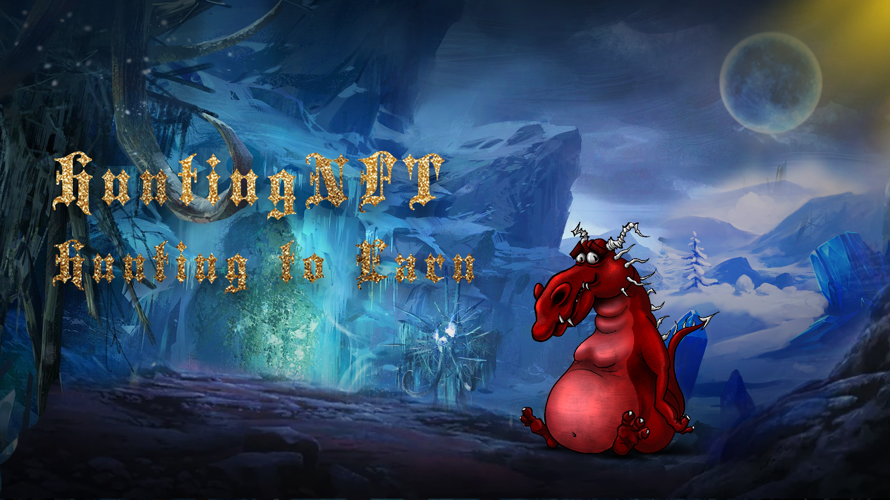

# HuntingNFT Intro

**HuntingNFT is a metaverse game based on NFT blockchain technology supported by Nervos network. Based on play-to-earn economy model that popular all over social media platforms, hunting battle survivors will have unique avatar dragons with their own lands and castles that can obtain taxes, rents and loot.**
