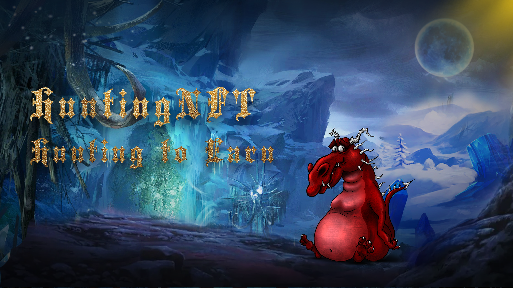

# 2.Hunting's worldview

Whenever the aurora appears, there will be many black giant islands in the far north of the extreme cold places. The ancient castles on each giant island are guarded by dragons all year round. The old people call these islands 「Wight Islands」. According to legend, the island is full of endless treasures. Warriors wearing dragon scale equipment can board the giant island, go to the castle to summon the dragon and obtain endless wealth, but no one has successfully returned.

Dragon scale fragments are magical treasures left by dragons on the mainland in ancient times. After being crafted by skilled craftsmen, they can be upgraded to magical swords, helmets, shields and other dragon scale equipment. The ancestors and tribes battled for the survival of the dragon scale fragments throughout the year, and only the survivors of the battle can obtain it.

Finally one day, you're so lucky got five pieces of dragon scale equipment, put them on, and go to the 「Wight Islands」 on the night when the aurora appears. Your story is about to begin……

HuntingNFT is a GameFi project initiated by Nervos global NFT Hodlers, which aims to combine the Nervos ecosystem's UniPass, mNFT, NervosDAO, YokaiSwap and other infrastructures, combined with gamification design, to explore more interesting gameplay based on NFT.

The game is based on the unique Play-to-Earn economic mode and highly balanced GameFi reward mechanism. Players can summon unique high-level dragons by obtaining dragon scales NFT equipment dropped in battle, and then go to the 「Wight Islands」 sandbox world through garrison and contribution through sacrifices and other methods, inherit land and castles, and get rich tax, rent and loot rewards.

Let's Hunting To Earn！

Currently HuntingNFT V1.0 beta has been launched, has opened the game lobby, Hunting wallet, Bonus pool and other functions, more gameplays will be launched soon.
