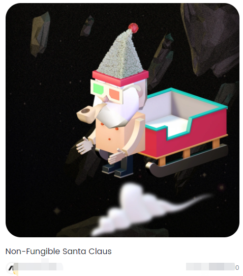
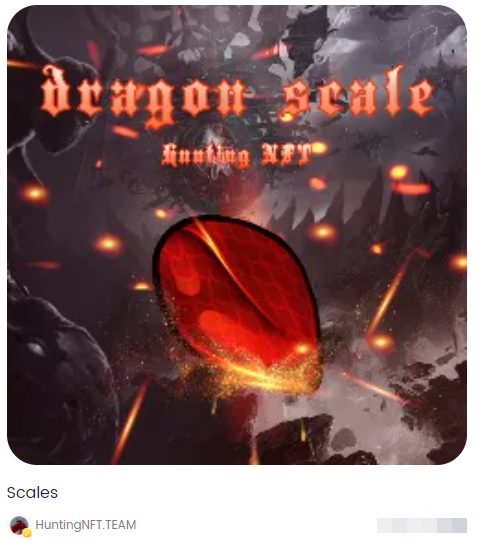
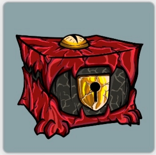
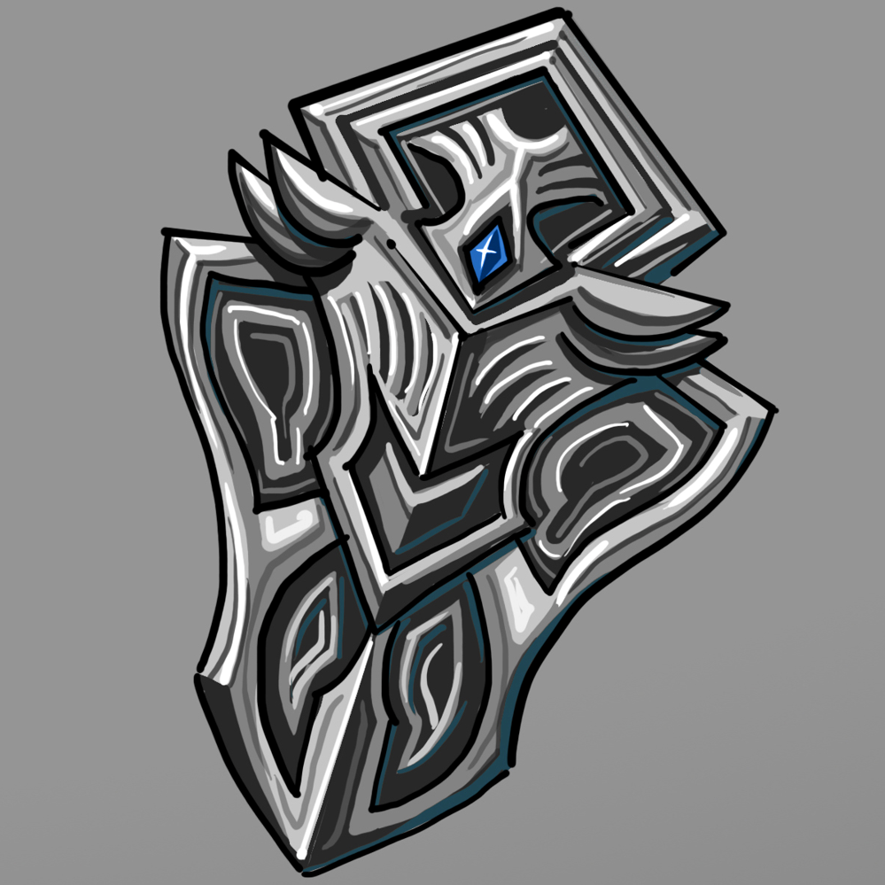
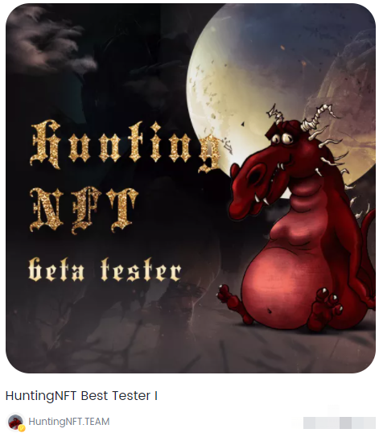
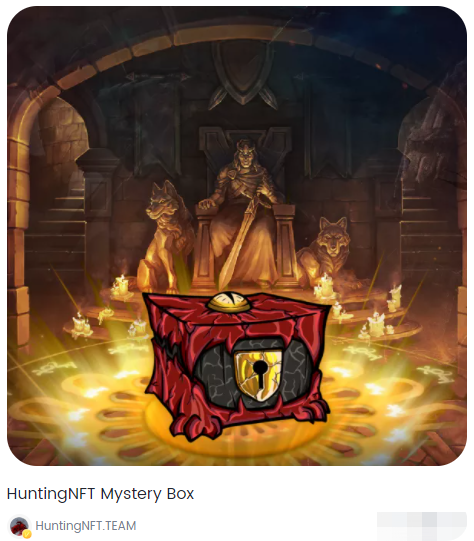

# 三、游戏物品

普通NFT：所有基于Nervos公链上秘宝平台生成的NFT，您可以选择使用它前往战场五人Battle，赢取掉落的装备或其龙鳞NFT，但请注意，无论输赢您都将永远失去这张NFT。

龙鳞NFT：由HutingNFT官方发行的龙鳞NFT，此NFT可用于参与战场五人Battle，可在官网首页使用CKB购买，也可积极参与官方活动，获取龙鳞奖励。

盲盒道具NFT：由HutingNFT官方发行的盲盒NFT，通过战斗掉落获得或前往官网频道购买，打开盲盒可随机获得龙鳞铠甲套装中的一件。

龙鳞套装NFT：由HutingNFT官方定制发行的龙鳞套装，套装由头盔、胸甲、盾牌、翅膀、宝剑五件组成，凑齐物件装备，可前往城堡之夜召唤恶龙。

游戏初期共提供10套由不同材质打造的套装，每件装备根据稀有度有不同的掉率，较为珍贵的或多余的装备可前往市场拍卖。

Best tester I-Ⅳ空投NFT：由HutingNFT官方定制发行的限量NFT，用于奖励前期参与测试的用户，用户未来可在项目IDO前前往官方网站将NFT兑换为游戏治理通证。

盲盒空投NFT：由HutingNFT官方定制发行的限量NFT，用于奖励前期积极参与官方活动用户，用户未来可在项目IDO前前往官方网站将NFT兑换为游戏治理通证。
